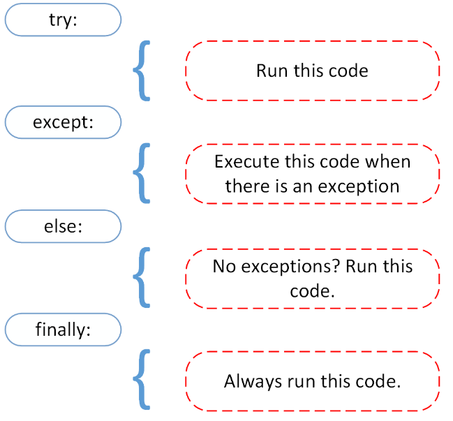

# Исключения 

## Источники

* [Документация](https://docs.python.org/3/library/exceptions.html)
* [Tutorial](https://docs.python.org/3/tutorial/errors.html)
* moin wiki:
    * [Handling Exceptions](https://wiki.python.org/moin/HandlingExceptions)
    * [Writing Exception Classes](https://wiki.python.org/moin/WritingExceptionClasses)
    * [Traceback Module](https://wiki.python.org/moin/TracebackModule)
* [Exception Patterns](http://wiki.c2.com/?ExceptionPatterns)

* [Intermediate Python - Exceptions](https://pavel-karateev.gitbook.io/intermediate-python/sintaksis/exceptions) (RU)

## Постановка задачи

Исключение (**exception**) - это аварийное состояние программы, возникшее во время исполнения.

Во время работы программы иногда возникают ситуации, когда выполнять программу нельзя или не имеет смысла:

* синтаксическая ошибка в коде;
* деление на ноль;
* выход за границы списка;
* попытка прочитать несуществующий файл и так далее.

В одном месте проблема проявилась (открытие файла), но реальная ошибка произошла в другом месте (пользователь указал неправильное имя файла), а что-то сделать с этой ситуацией мы можем в третьем месте (в коде диалога с пользователем сказать, что файл не существует и попросить его ввести имя файла еще раз).

Как доставить информацию об ошибке от места ее проявления (функция open) до места ее обработки?

* Возвращать из функции ошибку и обрабатывать что вернула функция. Делать это для всей цепочки вызова функций. Это подход языка С. Можно сделать в любом языке.

* Создавать объект exception и отправлять его вверх по стеку вызова функций, используя стандартный подход к обработке исключений (exception handling) языка. Так делают в языках python, C++, java и т.п.

Плюсы и минусы этих подходов:

* Код прозрачнее; алгоритм не зашумляется многочисленными строками обработки ошибок, которые просто возвращаются дальше по стеку вызова функций.

* в нашей функции мы можем вернуть код ошибки, но при ее вызове другой программист может его не обрабатывать, а просто игнорировать. Как часто вы проверяли в языке С, что вернул вызов printf?

## Термины

* **try**
* **except**
* **finally**
* **else**
* **raise**

```python
try:
    try_suite
except exception_group1 as variable1:
    except_suite1
…
except exception_groupN as variableN:
    except_suiteN
else:
    else_suite
finally:
    finally_suite
```

## Не пойманное исключение

```python
def foo(a):
    x = 5 / a
    print(x, a)
    
foo(5)
foo(0)      # на 0 делить нельзя
foo(7)
```
* foo(5) был вызван и выполнился. 
* foo(0) был вызван, но выполнение всей программы прекратилось на строке x = 5 / a
* foo(7) не вызвался.

Получили:
```
1.0 5
Traceback (most recent call last):
  File "nocatch.py", line 6, in <module>
    foo(0)      # на 0 делить нельзя
  File "nocatch.py", line 2, in foo
    x = 5 / a
ZeroDivisionError: division by zero
```

Это называется **stacktrace**.

Рассмотрим подробнее сообщение об ошибке. Напечатан стек вызова функций с указанием в каком файле на какой строке возникло исключение и код, который его породил.

```python
ZeroDivisionError: division by zero
```

**ZeroDivisionError** - тип исключения. Исключение - это такой же объект, как и другие данные в программе. 

**division by zero** - текст этого исключения. Зависит от типа.

## Блок try - except

Попробуем поймать исключение:

```python
def foo(a):
    x = 5 / a
    print(x, a)

try:    
    foo(5)
    foo(0)      # на 0 делить нельзя
    foo(7)
except ZeroDivisionError as e:
    print('Поймали исключение!')
    
print('После блока обработки исключений')
```
Получили:
```python
1.0 5
Поймали исключение!
После блока обработки исключений
```

Видим, что при поимке исключения, программа может выполняться дальше.

foo(7) - не выполняется, так как это блок try - то что нужно выполнить до первого исключения.

print('После блока обработки исключений') - программа работает дальше, после окончания try-ecxept блока.

## Как работает перехват исключений

* Вначале выполняется код, находящийся между операторами try и except.
* Если в ходе его выполнения исключения не произошло, то код в блоке except пропускается, а код в блоке try выполняется весь до конца.
* Если исключение происходит, то выполнение в рамках блока try прерывается и выполняется код в блоке except. При этом для оператора except можно указать, какие исключения можно обрабатывать в нем. При возникновении исключения, ищется именно тот блок except, который может обработать данное исключение.
* Если среди except блоков нет подходящего для обработки исключения, то оно передается наружу из блока try. В случае, если обработчик исключения так и не будет найден, то исключение будет необработанным (unhandled exception) и программа аварийно остановится.


## Много разных исключений

Иногда код может породить исключения разных типов.

Если они обрабатываются одинаково, то перечислите их типы через запятую:
```python
except (RuntimeError, TypeError, NameError):
    pass
```

Если нужна разная обработка, то пишем много except блоков:
```python
ecxept RuntimeError:
    print('один случай')
ecxept TypeError:
    print('второй случай')
ecxept NameError:
    print('третий случай')
```

Примеры. Перечисление:
```python
import traceback
import sys

def foo(a):
    b = [1, 2, 3]
    x = 5 / a
    y = b[a]
    print(x, a, y)

try:    
    foo(2)
    # foo(0)      # на 0 делить нельзя
    foo(7)
except (ZeroDivisionError, IndexError)  as e:
    print('Поймали исключение!')
    print(e)
    print('-'*60)
    traceback.print_exc(file=sys.stdout)
    print('-'*60)
    
print('После блока обработки исключений')
```

Отдельные блоки:
```python
import traceback
import sys

def foo(a):
    b = [1, 2, 3]
    x = 5 / a
    y = b[a]
    print(x, a, y)

try:    
    foo(2)      # ok
    foo(0)      # на 0 делить нельзя
    foo(7)      # выход за границы списка
except ZeroDivisionError:
    pass
except IndexError  as e:
    print('Поймали исключение!')
    print(e)
    print('-'*60)
    traceback.print_exc(file=sys.stdout)
    print('-'*60)
    
print('После блока обработки исключений')
```

## Разные исключения ловим в разных местах

Вызываются функции bzz -> qqq -> foo.

В foo возникают исключения ZeroDivisionError и IndexError.

Поймаем исключение ZeroDivisionError в функции qqq, а IndexError в функции bzz.

```python
import traceback
import sys

def foo(a):
    b = [1, 2, 3]
    x = 5 / a
    y = b[a]
    print(x, a, y)
    
def qqq(a):
    try:
        foo(a)
    except ZeroDivisionError:
        print('qqq: ZeroDivisionError')
        traceback.print_exc(file=sys.stdout)
    print('qqq: After try-ecxept block')
        
def bzz(a):
    try:
        qqq(a)
    except IndexError:
        print('bzz: IndexError')
        traceback.print_exc(file=sys.stdout)
    print('bzz: After try-ecxept block\n')

bzz(2)
        # 2.5 2 3
        # qqq: After try-ecxept block
        # bzz: After try-ecxept block
bzz(0)
        # qqq: ZeroDivisionError
        # qqq: After try-ecxept block
        # bzz: After try-ecxept block
bzz(7)
        # bzz: IndexError
        # bzz: After try-ecxept block
```

Обратите внимание на различие в stacktrace.

```python
2.5 2 3
qqq: After try-ecxept block
bzz: After try-ecxept block

qqq: ZeroDivisionError
Traceback (most recent call last):
  File "2_2try_tb.py", line 12, in qqq
    foo(a)
  File "2_2try_tb.py", line 6, in foo
    x = 5 / a
ZeroDivisionError: division by zero
qqq: After try-ecxept block
bzz: After try-ecxept block

bzz: IndexError
Traceback (most recent call last):
  File "2_2try_tb.py", line 20, in bzz
    qqq(a)
  File "2_2try_tb.py", line 12, in qqq
    foo(a)
  File "2_2try_tb.py", line 7, in foo
    y = b[a]
IndexError: list index out of range
bzz: After try-ecxept block
```

## Иерархия исключений

Какой тип в блоке except является подходящим, чтобы перехватить исключение?

Точно такой же или его предок в иерархии классов исключений.

Ищем походящий блок сверху вниз:
```python
import traceback
import sys

def foo(a):
    b = [1, 2, 3]
    x = 5 / a
    y = b[a]
    print(x, a, y)

try:    
    foo(2)      # ok
    #foo(0)      # на 0 делить нельзя
    foo(7)      # выход за границы списка
except Exception:           # ловим еще исключения, которые наследуют от класса Exception
    pass
except IndexError  as e:    # никогда не выполнится, исключение поймали раньше
    print('Поймали исключение!')
    print(e)
    print('-'*60)
    traceback.print_exc(file=sys.stdout)
    print('-'*60)
    
print('После блока обработки исключений')
```

При выходе за границы массива исключение будет перехвачено в блоке except Exception, потому что в предках класса IndexError есть Exception.

Пишем исключения от самых специфических (сначала) к более общим (ниже).

** Никогда не пишите ecxept Exception**. Так вы поймаете (чужие) исключения, которые не позволят диагностировать логическую ошибку в программе.

**except без указания типа ловит все исключения. Не надо так писать!**

Информация о дереве наследования:
```python
BaseException
 +-- SystemExit
 +-- KeyboardInterrupt
 +-- GeneratorExit
 +-- Exception
      +-- StopIteration
      +-- StopAsyncIteration
      +-- ArithmeticError
      |    +-- FloatingPointError
      |    +-- OverflowError
      |    +-- ZeroDivisionError
      +-- AssertionError
      +-- AttributeError
      +-- BufferError
      +-- EOFError
      +-- ImportError
      |    +-- ModuleNotFoundError
      +-- LookupError
      |    +-- IndexError
      |    +-- KeyError
      +-- MemoryError
      +-- NameError
      |    +-- UnboundLocalError
      +-- OSError
      |    +-- BlockingIOError
      |    +-- ChildProcessError
      |    +-- ConnectionError
      |    |    +-- BrokenPipeError
      |    |    +-- ConnectionAbortedError
      |    |    +-- ConnectionRefusedError
      |    |    +-- ConnectionResetError
      |    +-- FileExistsError
      |    +-- FileNotFoundError
      |    +-- InterruptedError
      |    +-- IsADirectoryError
      |    +-- NotADirectoryError
      |    +-- PermissionError
      |    +-- ProcessLookupError
      |    +-- TimeoutError
      +-- ReferenceError
      +-- RuntimeError
      |    +-- NotImplementedError
      |    +-- RecursionError
      +-- SyntaxError
      |    +-- IndentationError
      |         +-- TabError
      +-- SystemError
      +-- TypeError
      +-- ValueError
      |    +-- UnicodeError
      |         +-- UnicodeDecodeError
      |         +-- UnicodeEncodeError
      |         +-- UnicodeTranslateError
      +-- Warning
           +-- DeprecationWarning
           +-- PendingDeprecationWarning
           +-- RuntimeWarning
           +-- SyntaxWarning
           +-- UserWarning
           +-- FutureWarning
           +-- ImportWarning
           +-- UnicodeWarning
           +-- BytesWarning
           +-- ResourceWarning
```

### Обзор исключений

* BaseException - базовое исключение, от которого берут начало все остальные.
    * SystemExit - исключение, порождаемое функцией sys.exit при выходе из программы.
    * KeyboardInterrupt - порождается при прерывании программы пользователем (обычно сочетанием клавиш Ctrl+C).
    * GeneratorExit - порождается при вызове метода close объекта generator.
    * Exception - а вот тут уже заканчиваются полностью системные исключения (которые лучше не трогать) и начинаются обыкновенные, с которыми можно работать.
        * StopIteration - порождается встроенной функцией next, если в итераторе больше нет элементов.
        * ArithmeticError - арифметическая ошибка.
            * FloatingPointError - порождается при неудачном выполнении операции с плавающей запятой. На практике встречается нечасто.
            * OverflowError - возникает, когда результат арифметической операции слишком велик для представления. Не появляется при обычной работе с целыми числами (так как python поддерживает длинные числа), но может возникать в некоторых других случаях.
            * ZeroDivisionError - деление на ноль.
        * AssertionError - выражение в функции assert ложно.
        * AttributeError - объект не имеет данного атрибута (значения или метода).
        * BufferError - операция, связанная с буфером, не может быть выполнена.
        * EOFError - функция наткнулась на конец файла и не смогла прочитать то, что хотела.
        * ImportError - не удалось импортирование модуля или его атрибута.
        * LookupError - некорректный индекс или ключ.
            * IndexError - индекс не входит в диапазон элементов.
            * KeyError - несуществующий ключ (в словаре, множестве или другом объекте).
        * MemoryError - недостаточно памяти.
        * NameError - не найдено переменной с таким именем.
            * UnboundLocalError - сделана ссылка на локальную переменную в функции, но переменная не определена ранее.
        * OSError - ошибка, связанная с системой.
            * BlockingIOError
            * ChildProcessError - неудача при операции с дочерним процессом.
            * ConnectionError - базовый класс для исключений, связанных с подключениями.
                * BrokenPipeError
                * ConnectionAbortedError
                * ConnectionRefusedError
                * ConnectionResetError
            * FileExistsError - попытка создания файла или директории, которая уже существует.
            * FileNotFoundError - файл или директория не существует.
            * InterruptedError - системный вызов прерван входящим сигналом.
            * IsADirectoryError - ожидался файл, но это директория.
            * NotADirectoryError - ожидалась директория, но это файл.
            * PermissionError - не хватает прав доступа.
            * ProcessLookupError - указанного процесса не существует.
            * TimeoutError - закончилось время ожидания.
        * ReferenceError - попытка доступа к атрибуту со слабой ссылкой.
        * RuntimeError - возникает, когда исключение не попадает ни под одну из других категорий.
        * NotImplementedError - возникает, когда абстрактные методы класса требуют переопределения в дочерних классах.
        * SyntaxError - синтаксическая ошибка.
            * IndentationError - неправильные отступы.
                * TabError - смешивание в отступах табуляции и пробелов.
        * SystemError - внутренняя ошибка.
        * TypeError - операция применена к объекту несоответствующего типа.
        * ValueError - функция получает аргумент правильного типа, но некорректного значения.
        * UnicodeError - ошибка, связанная с кодированием / раскодированием unicode в строках.
            * UnicodeEncodeError - исключение, связанное с кодированием unicode.
            * UnicodeDecodeError - исключение, связанное с декодированием unicode.
            * UnicodeTranslateError - исключение, связанное с переводом unicode.
        * Warning - предупреждение.

### Как узнать какие исключения может выпускать функция?

**Все пропускаемые исключения обязаны быть описаны в документации.**

Цитата из документации по встроенной функции open:

open(file, mode='r', buffering=-1, encoding=None, errors=None, newline=None, closefd=True, opener=None)¶
Open file and return a corresponding file object. If the file cannot be opened, an OSError is raised.

## Блок finally - в конце концов (всегда)

Что делать, если нужно закрыть файл (или выполнить любую clean-up операцию по освобождению ресурсов), вне зависимости, успешно отработал try блок или в нем возникло исключение.

Нужно использовать блок **finally**

* Если исключения не возникло, то после блока try выполняется блок finally.
* Если исключение возникло и было перехвачено в одном из блоков except, то после него выполняется finally.
* Если исключение возникло, но не нашлось в функции подходящего ecxept, то *сначала* будет выполнен блок finally, а *потом* исключение будет передано вверх по стеку вызова функций.


```python
try:
    file = open('test.txt', 'rb')
except IOError as e:
    print('Было вызвано исключение IOError. {}'.format(e.args[-1]))
finally:
    print("Я буду напечатан вне зависимости от исключений в блоке try!")
​
# Вывод: Было вызвано исключение IOError. No such file or directory
#        Я буду напечатан вне зависимости от исключений в блоке try!
```

## else - try и еще немного

Если несколько выражений в try могут вызвать исключения и хочется отделить исключения одного от исключений другого, то можно или разбить его на несколько try-ecxept блоков, или (если исключения хочется обработать выше в стеке) написать else блок.

```python
try:
  do_some_stuff()
except:             # не указан тип? берем все исключения!
  rollback()
  raise             # генерируем повтороно последнее исключение
else:
  commit()
```

### Все вместе

```python
try:
    print('Я уверен, исключений не будет!')
except Exception:
    print('Исключение')
else:
    # Любой код, который должен быть исполнен, если исключение в блоке
    # try не было вызвано, но для которого не должна проводиться
    # обработка исключений
    print('Я буду исполнен, если в try не будет исключений.'
          'Мои исключения не будут обрабатываться.')
finally:
    print('Я буду исполнен в любом случае!')
​
# Вывод: Я уверен, исключений не будет!
#        Я буду исполнен, если в try не будет исключений. Мои исключения не будут обрабатываться.
#        Я буду исполнен в любом случае!
```


Перерисовать, ибо потащено с https://realpython.com/python-exceptions/#the-else-clause

### Контрольный выстрел

Что вернет функция при следующих вызовах:

```python
def foo(a):
    b = [1, 2, 3]
    x = 5 / a
    y = b[a]
    print(x, a, y)
    
def bzz(a):
    try:
        foo(a)
        print('try')
        return 1            # пока в try есть return, else не вызовется
    except:
        print('ecxept')
        return 2
    else:
        print('else')
        return 3
    finally:
        print('finally')
        return 4
    return 5
    
print('bzz({})={}'.format(2, bzz(2)))
print('bzz({})={}'.format(0, bzz(0)))
print('bzz({})={}'.format(7, bzz(7)))
```

## Генерация исключений в Python

Для принудительной генерации исключения используется инструкция **raise**.

Самый простой пример работы с raise может выглядеть так.
```python
try:
   raise Exception("Some exception")
except Exception as e:
   print("Exception exception " + str(e))
```
Таким образом, можно "вручную" вызывать исключения при необходимости.

Или перевызвать последнее исключение, вызвав **raise** без параметров.

## Информация в исключении

Обычно достаточно перехватить исключение и реагировать на сам факт его появления.

**args** - это кортеж составных частей исключения. В него можно добавить свою информацию.

Код
```python
(a,b,c) = d
```
может породить исключение
```python
ValueError: unpack list of wrong size
```

Сразу возникает вопрос - а что в переменной d, что не удалось его распаковать. Добавим значение переменной d в исключение и raise обновленное исключение.

```python
try:
  a, b, c = d
except Exception as e:
  e.args += (d,)
  raise
```


Иногда нужно логировать исключение или обрабатывать дополнительную информацию.
```python
import traceback
import sys

def foo(a):
    x = 5 / a
    print(x, a)

try:    
    foo(5)
    foo(0)      # на 0 делить нельзя
    foo(7)
except ZeroDivisionError as e:                  # если e не нужно, то as e не пишем
    print('Поймали исключение!')
    print(e)                                    # печать 'division by zero'
    print('-'*60)
    traceback.print_exc(file=sys.stdout)        # печать stacktrace
    print('-'*60)
    
print('После блока обработки исключений')
```
Получили:
```python
1.0 5
Поймали исключение!
division by zero
------------------------------------------------------------
Traceback (most recent call last):
  File "1try.py", line 10, in <module>
    foo(0)      # на 0 делить нельзя
  File "1try.py", line 5, in foo
    x = 5 / a
ZeroDivisionError: division by zero
------------------------------------------------------------
После блока обработки исключений
```

### Напечатать только сообщение исключения

**str(e)** - просто преобразуйте исключение к строке.

### Напечатать stacktrace исключения

[Документация](https://docs.python.org/3/library/traceback.html)

Используйте функцию **traceback.print_exc()**

### Тип, значение и traceback

Используйте функцию **sys.exc_info()**
 
```python
exc_type, exc_value, exc_traceback = sys.exc_info()
```

### Пример, как все это используется

Сохраните программу в файл tb.py и запустите ее.
```python
import sys, traceback

def lumberjack():
    bright_side_of_death()

def bright_side_of_death():
    return tuple()[0]

try:
    lumberjack()
except IndexError:
    exc_type, exc_value, exc_traceback = sys.exc_info()
    
    print("*** print_tb:")
    traceback.print_tb(exc_traceback, limit=1, file=sys.stdout)
    
    print("*** print_exception:")
    # exc_type below is ignored on 3.5 and later
    traceback.print_exception(exc_type, exc_value, exc_traceback,
                              limit=2, file=sys.stdout)
                              
    print("*** print_exc:")
    traceback.print_exc(limit=2, file=sys.stdout)
    
    print("*** format_exc, first and last line:")
    formatted_lines = traceback.format_exc().splitlines()
    print(formatted_lines[0])
    print(formatted_lines[-1])
    
    print("*** format_exception:")
    # exc_type below is ignored on 3.5 and later
    print(repr(traceback.format_exception(exc_type, exc_value,
                                          exc_traceback)))
                                          
    print("*** extract_tb:")
    print(repr(traceback.extract_tb(exc_traceback)))
    print("*** format_tb:")
    print(repr(traceback.format_tb(exc_traceback)))
    print("*** tb_lineno:", exc_traceback.tb_lineno)
```
Получилось:
```python
*** print_tb:
  File "tb.py", line 10, in <module>
    lumberjack()
*** print_exception:
Traceback (most recent call last):
  File "tb.py", line 10, in <module>
    lumberjack()
  File "tb.py", line 4, in lumberjack
    bright_side_of_death()
IndexError: tuple index out of range
*** print_exc:
Traceback (most recent call last):
  File "tb.py", line 10, in <module>
    lumberjack()
  File "tb.py", line 4, in lumberjack
    bright_side_of_death()
IndexError: tuple index out of range
*** format_exc, first and last line:
Traceback (most recent call last):
IndexError: tuple index out of range
*** format_exception:
['Traceback (most recent call last):\n', '  File "tb.py", line 10, in <module>\n    lumberjack()\n', '  File "tb.py", line 4, in lumberjack\n    bright_side_of_death()\n', '  File "tb.py", line 7, in bright_side_of_death\n    return tuple()[0]\n', 'IndexError: tuple index out of range\n']
*** extract_tb:
[<FrameSummary file tb.py, line 10 in <module>>, <FrameSummary file tb.py, line 4 in lumberjack>, <FrameSummary file tb.py, line 7 in bright_side_of_death>]
*** format_tb:
['  File "tb.py", line 10, in <module>\n    lumberjack()\n', '  File "tb.py", line 4, in lumberjack\n    bright_side_of_death()\n', '  File "tb.py", line 7, in bright_side_of_death\n    return tuple()[0]\n']
*** tb_lineno: 10
```

## Свои исключения

Старайтесь их не делать. Поищите в иерархии уже существующих наиболее подходящий.

Иногда специфика задачи требует свои исключения. Например, когда рассчетная задача и какой-то параметр (например, размер трещины) вдруг становится невозможным физически (отрицательным или слишком большим). Тогд имеет смысл ввести свое исключение. Но можно использовать ValueError.

Простейший пример: в исключении нужно только имя типа. Тогда наследуйтесь от Exception и ничего не изменяйте.
```python
class MyException(Exception):
    pass
```
Использовать точно так же, как другие типы исключений.

Пример посложнее: добавим новое исключение HostNotFound, который содержит в себе имя хоста.

```python
class HostNotFound(Exception):
    def __init__( self, host ):
        self.host = host
        Exception.__init__(self, 'Host Not Found exception: missing %s' % host)
```
использование:
```python
try:
    raise HostNotFound("taoriver.net")
except HostNotFound, exc:
    # Handle exception.
    print exc               # -> 'Host Not Found exception: missing taoriver.net'
    print exc.host          # -> 'taoriver.net'
```

## Заключение

* Исключение - простой способ разнести в коде место ошибки и ее обработку.
* try-ecxept-else-finally блок
    * **try** - код, который может породить исключение
    * **ecxept** - перехват исключений
        * '''ecxept (ZeroDivisionError, IndexError) as e:'''
        * '''ecxept ZeroDivisionError as e:'''
        * '''ecxept ZeroDivisionError:'''
        * '''ecxept:''' - перехват всех исключений. Так не нужно писать.
    * **else** - если try прошло БЕЗ исключений.
    * **finally** - clean-up фаза, выполнится в любом случае.
* **raise** - генерация исключения  
    * 'raise ValueError("Negative length")' - создание нового исключения
    * 'raise e' - повторный запуск исключения e (что стало со стектрейсом?)
    * 'raise' - повторный запуск последнего исключения.
* создаем свое исключение: 'class MyException(Exception): pass'
* информация об исключении e:
    * 'str(e)' - division by zero
    * 'exc_type, exc_value, exc_traceback = sys.exc_info()' - что хранится в исключении
    * 'traceback.print_exc(file=sys.stdout)' - печать стектрейса  

### Заключительный пример

```python
try:
    print('Я уверен, исключений не будет!')
except Exception:
    print('Исключение')
else:
    # Любой код, который должен быть исполнен, если исключение в блоке
    # try не было вызвано, но для которого не должна проводиться
    # обработка исключений
    print('Я буду исполнен, если в try не будет исключений.'
          'Мои исключения не будут обрабатываться.')
finally:
    print('Я буду исполнен в любом случае!')
​
# Вывод: Я уверен, исключений не будет!
#        Я буду исполнен, если в try не будет исключений. Мои исключения не будут обрабатываться.
#        Я буду исполнен в любом случае!
```


