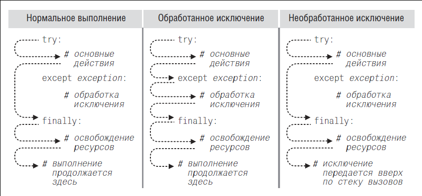
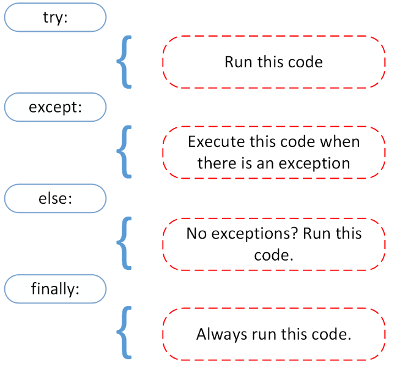

## Блок finally - в конце концов (всегда)

Что делать, если нужно закрыть файл (или выполнить любую clean-up операцию по освобождению ресурсов), вне зависимости, успешно отработал try блок или в нем возникло исключение.

Нужно использовать блок **finally**

* Если исключения не возникло, то после блока try выполняется блок finally.
* Если исключение возникло и было перехвачено в одном из блоков except, то после него выполняется finally.
* Если исключение возникло, но не нашлось в функции подходящего ecxept, то *сначала* будет выполнен блок finally, а *потом* исключение будет передано вверх по стеку вызова функций.



```python
try:
    file = open('test.txt', 'rb')
except IOError as e:
    print('Было вызвано исключение IOError. {}'.format(e.args[-1]))
finally:
    print("Я буду напечатан вне зависимости от исключений в блоке try!")
​
# Вывод: Было вызвано исключение IOError. No such file or directory
#        Я буду напечатан вне зависимости от исключений в блоке try!
```

## else - try и еще немного

Если несколько выражений в try могут вызвать исключения и хочется отделить исключения одного от исключений другого, то можно или разбить его на несколько try-ecxept блоков, или (если исключения хочется обработать выше в стеке) написать else блок.

```python
try:
  do_some_stuff()
except:             # не указан тип? берем все исключения!
  rollback()
  raise             # генерируем повтороно последнее исключение
else:
  commit()
```

### Все вместе

```python
try:
    print('Я уверен, исключений не будет!')
except Exception:
    print('Исключение')
else:
    # Любой код, который должен быть исполнен, если исключение в блоке
    # try не было вызвано, но для которого не должна проводиться
    # обработка исключений
    print('Я буду исполнен, если в try не будет исключений.'
          'Мои исключения не будут обрабатываться.')
finally:
    print('Я буду исполнен в любом случае!')
​
# Вывод: Я уверен, исключений не будет!
#        Я буду исполнен, если в try не будет исключений. Мои исключения не будут обрабатываться.
#        Я буду исполнен в любом случае!
```


Перерисовать, ибо потащено с https://realpython.com/python-exceptions/#the-else-clause

### Контрольный выстрел

Что вернет функция при следующих вызовах:

```python
def foo(a):
    b = [1, 2, 3]
    x = 5 / a
    y = b[a]
    print(x, a, y)
    
def bzz(a):
    try:
        foo(a)
        print('try')
        return 1            # пока в try есть return, else не вызовется
    except:
        print('ecxept')
        return 2
    else:
        print('else')
        return 3
    finally:
        print('finally')
        return 4
    return 5
    
print('bzz({})={}'.format(2, bzz(2)))
print('bzz({})={}'.format(0, bzz(0)))
print('bzz({})={}'.format(7, bzz(7)))
```

## Гарантированная 