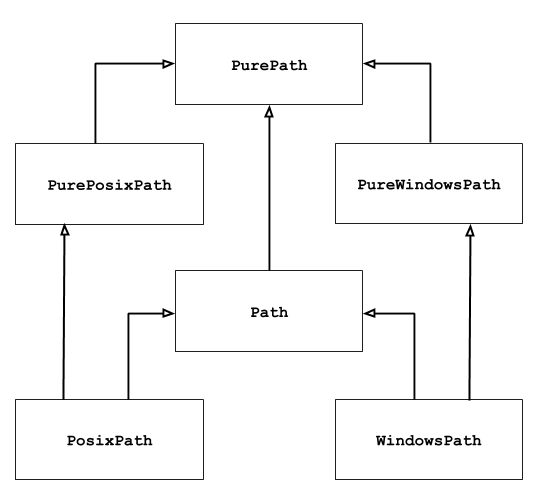

## pathlib - высокоуровневый модуль работы с путями

### Источники:

* https://docs.python.org/3/library/pathlib.html
* https://pymotw.com/3/os/index.html
* https://pymotw.com/3/pathlib/index.html

This module offers classes representing filesystem paths with semantics appropriate for different operating systems. Path classes are divided between pure paths, which provide purely computational operations without I/O, and concrete paths, which inherit from pure paths but also provide I/O operations.

If you’ve never used this module before or just aren’t sure which class is right for your task, Path is most likely what you need. It instantiates a concrete path for the platform the code is running on.

Pure paths are useful in some special cases; for example:

If you want to manipulate Windows paths on a Unix machine (or vice versa). You cannot instantiate a WindowsPath when running on Unix, but you can instantiate PureWindowsPath.
You want to make sure that your code only manipulates paths without actually accessing the OS. In this case, instantiating one of the pure classes may be useful since those simply don’t have any OS-accessing operations.



**Везде далее в примерах предполагается, что ранее написано import pathlib**

### Построение путей

```python
# pathlib_operator.py
import pathlib

usr = pathlib.PurePosixPath('/usr')
print(usr)

usr_local = usr / 'local'
print(usr_local)

usr_share = usr / pathlib.PurePosixPath('share')
print(usr_share)

root = usr / '..'
print(root)

etc = root / '/etc/'
print(etc)
```
Получим:
```python
/usr
/usr/local
/usr/share
/usr/..
/etc
```

**resolve**:
```python
usr_local = pathlib.Path('/usr/local')
share = usr_local / '..' / 'share'
print(share.resolve())              # /usr/share
```

**joinpath**

```python
root = pathlib.PurePosixPath('/')
subdirs = ['usr', 'local']
usr_local = root.joinpath(*subdirs)
print(usr_local)                    # /usr/local
```

```python
ind = pathlib.PurePosixPath('source/pathlib/index.rst')
print(ind)                          # source/pathlib/index.rst

py = ind.with_name('pathlib_from_existing.py')
print(py)                           # source/pathlib/pathlib_from_existing.py

pyc = py.with_suffix('.pyc')
print(pyc)                          # source/pathlib/pathlib_from_existing.pyc
```

### Parsing Paths

```python
p = pathlib.PurePosixPath('/usr/local')
print(p.parts)                      # ('/', 'usr', 'local')
```

Вверх по дереву директорий:

```python
p = pathlib.PurePosixPath('/usr/local/lib')

print('parent: {}'.format(p.parent))

print('\nhierarchy:')
for up in p.parents:
    print(up)
```
 получим:
 ```python
parent: /usr/local

hierarchy:
/usr/local
/usr
/
```

Полезные функции:
```python
p = pathlib.PurePosixPath('./source/pathlib/pathlib_name.py')
print('path  : {}'.format(p))           # source/pathlib/pathlib_name.py
print('name  : {}'.format(p.name))      # pathlib_name.py
print('suffix: {}'.format(p.suffix))    # .py
print('stem  : {}'.format(p.stem))      # pathlib_name
```

### home, current working directory

```python
home = pathlib.Path.home()
print('home: ', home)       # home:  /Users/dhellmann

cwd = pathlib.Path.cwd()
print('cwd : ', cwd)        # cwd :  /Users/dhellmann/PyMOTW
```

### Directory Contents

```python
p = pathlib.Path('.')

for f in p.iterdir():
    print(f)
```
получим итератор или NotADirectoryError:
```python
example_link
index.rst
pathlib_chmod.py
pathlib_convenience.py
pathlib_from_existing.py
pathlib_glob.py
pathlib_iterdir.py
pathlib_joinpath.py
pathlib_mkdir.py
pathlib_name.py
pathlib_operator.py
pathlib_ownership.py
pathlib_parents.py
pathlib_parts.py
pathlib_read_write.py
pathlib_resolve.py
pathlib_rglob.py
pathlib_rmdir.py
pathlib_stat.py
pathlib_symlink_to.py
pathlib_touch.py
pathlib_types.py
pathlib_unlink.py
```

Соединим с `glob` (список только .rst файлов):
```python
p = pathlib.Path('..')

for f in p.glob('*.rst'):
    print(f)
```
получим:
```python
../about.rst
../algorithm_tools.rst
../book.rst
```
Нужно взять по маске? Используйте **rglob** вместо `glob`:
```python
p = pathlib.Path('..')

for f in p.rglob('pathlib_*.py'):
    print(f)
```
получим:
```python
../pathlib/pathlib_chmod.py
../pathlib/pathlib_convenience.py
../pathlib/pathlib_from_existing.py
```

### Чтение и запись файлов

```python
f = pathlib.Path('example.txt')

f.write_bytes('This is the content'.encode('utf-8'))

with f.open('r', encoding='utf-8') as handle:
    print('read from open(): {!r}'.format(handle.read()))

print('read_text(): {!r}'.format(f.read_text('utf-8')))
```
получим:
```python
read from open(): 'This is the content'
read_text(): 'This is the content'
```

### mkdir

Создаем директорию или получаем исключение FileExistsError:
```python
p = pathlib.Path('example_dir')

print('Creating {}'.format(p))
p.mkdir()
```

### symlink

```python
p = pathlib.Path('example_link')

p.symlink_to('index.rst')

print(p)                # example_link
print(p.resolve().name) # index.rst
```

### File type

```python
import itertools
import os
import pathlib

root = pathlib.Path('test_files')

# Clean up from previous runs.
if root.exists():
    for f in root.iterdir():
        f.unlink()
else:
    root.mkdir()

# Create test files
(root / 'file').write_text(
    'This is a regular file', encoding='utf-8')
(root / 'symlink').symlink_to('file')
os.mkfifo(str(root / 'fifo'))

# Check the file types
to_scan = itertools.chain(
    root.iterdir(),
    [pathlib.Path('/dev/disk0'),
     pathlib.Path('/dev/console')],
)
hfmt = '{:18s}' + ('  {:>5}' * 6)
print(hfmt.format('Name', 'File', 'Dir', 'Link', 'FIFO', 'Block',
                  'Character'))
print()

fmt = '{:20s}  ' + ('{!r:>5}  ' * 6)
for f in to_scan:
    print(fmt.format(
        str(f),
        f.is_file(),
        f.is_dir(),
        f.is_symlink(),
        f.is_fifo(),
        f.is_block_device(),
        f.is_char_device(),
    ))
```
Получим:
```python
Name                 File    Dir   Link   FIFO  Block  Character

test_files/fifo       False  False  False   True  False  False
test_files/file        True  False  False  False  False  False
test_files/symlink     True  False   True  False  False  False
/dev/disk0            False  False  False  False   True  False
/dev/console          False  False  False  False  False   True
```

### File Properties

Detailed information about a file can be accessed using the methods stat() or lstat() (for checking the status of something that might be a symbolic link). These methods produce the same results as os.stat() and os.lstat().

```python
import pathlib
import sys
import time

if len(sys.argv) == 1:
    filename = __file__
else:
    filename = sys.argv[1]

p = pathlib.Path(filename)
stat_info = p.stat()

print('{}:'.format(filename))
print('  Size:', stat_info.st_size)
print('  Permissions:', oct(stat_info.st_mode))
print('  Owner:', stat_info.st_uid)
print('  Device:', stat_info.st_dev)
print('  Created      :', time.ctime(stat_info.st_ctime))
print('  Last modified:', time.ctime(stat_info.st_mtime))
print('  Last accessed:', time.ctime(stat_info.st_atime))
```
получаем при запусках:
```python
$ python3 pathlib_stat.py

pathlib_stat.py:
  Size: 607
  Permissions: 0o100644
  Owner: 527
  Device: 16777220
  Created      : Thu Dec 29 12:38:23 2016
  Last modified: Thu Dec 29 12:38:23 2016
  Last accessed: Sun Mar 18 16:21:41 2018

$ python3 pathlib_stat.py index.rst

index.rst:
  Size: 19569
  Permissions: 0o100644
  Owner: 527
  Device: 16777220
  Created      : Sun Mar 18 16:11:31 2018
  Last modified: Sun Mar 18 16:11:31 2018
  Last accessed: Sun Mar 18 16:21:40 2018
```

**owner, group**:
```python
# pathlib_ownership.py
import pathlib

p = pathlib.Path(__file__)

print('{} is owned by {}/{}'.format(p, p.owner(), p.group()))
# pathlib_ownership.py is owned by dhellmann/dhellmann
```

The **touch()** method works like the Unix command touch to create a file or update an existing file’s modification time and permissions.

### Permissions

```python
import os
import pathlib
import stat

# Create a fresh test file.
f = pathlib.Path('pathlib_chmod_example.txt')
if f.exists():
    f.unlink()
f.write_text('contents')

# Determine what permissions are already set using stat.
existing_permissions = stat.S_IMODE(f.stat().st_mode)
print('Before: {:o}'.format(existing_permissions))

# Decide which way to toggle them.
if not (existing_permissions & os.X_OK):
    print('Adding execute permission')
    new_permissions = existing_permissions | stat.S_IXUSR
else:
    print('Removing execute permission')
    # use xor to remove the user execute permission
    new_permissions = existing_permissions ^ stat.S_IXUSR

# Make the change and show the new value.
f.chmod(new_permissions)
after_permissions = stat.S_IMODE(f.stat().st_mode)
print('After: {:o}'.format(after_permissions))
```
получим:
```python
Before: 644
Adding execute permission
After: 744
```

### Удаление

**rmdir()** - удалить директорию

**unlink()** - удалить файл(!!!), разорвать связь и тп.

```python
p = pathlib.Path('touched')

p.touch()

print('exists before removing:', p.exists())

p.unlink()

print('exists after removing:', p.exists())
```
получим:
```python
exists before removing: True
exists after removing: False
```