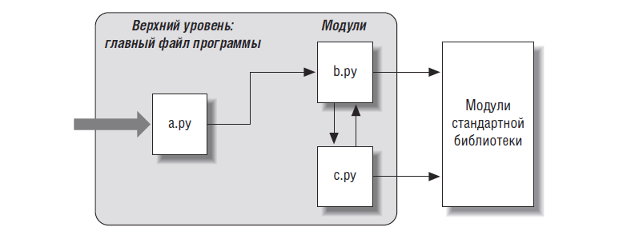

# Модули - введение

**Модуль** - это 1 файл на питоне или другом языке (расширение на С, С++, Java и тп).

Зачем?
* повторное использование программного кода;
* свое пространство имен;
* модульность программного кода (наружу API, внутренность можно рефакторить).

## Как организована программа на языке Python

Предполагаем, что программа состоит из нескольких файлов и сторонних библиотек.

Архитектура программы = главный файл (сценарий) + дополнительные файлы (модули, которые подключаются к главному).

Обычно файлы модулей ничего не делают, если запустить их отдельно (или выполняют тесты данного модуля).

Пусть программа состоит из файлов a.py, b.py, c.py. Арихтектура программы:



`a.py` - текстовый файл с инструкциями, выполняются от начала до конца;

`b.py`, `c.py` - текстовые файлы с инструкциями, содержат переменные и функции (и быть может код), не выполняются самостоятельно.

b.py:
```python
def spam(text):
    print(text, 'spam')
``` 
a.py:
```python
import b
b.spam('qqq')
```

`import b` - (во время выполнения программы) загрузить файл b.py (если он еще не загружен) и дать доступ к его атрибутам через имя модуля b.

**Атрибуты модуля** - имена глобальных переменных этого модуля и его функции.

**import** - связь имен (модуля) и загруженных объектов (модулей). **Выполняется содержимое импортируемого файла**

`b.spam` - извлечь значение имени spam, расположенное в модуле b.

**Любой файл может импортировать функциональные возможности из любого другого файла**.
* a.py может импортировать b.py
* b.py может импортировать c.py
* c.py может импортировать b.py (который импортирует c.py, который импортирует b.py и так далее)
* и все могут импортировать любые модули стандартных и прочих библиотек.

## Как работает import

* Ищется информация об этом модуле в словаре `sys.modules`.
  * Если модуль в словаре уже есть, берут расположенный в памяти объект модуля.
  * Если модуля в словаре нет (первый импорт):
    * Ищут файл модуля.
    * Компилируют его в байт-код (если нужно).
    * Выполняют его, чтобы создать его объекты.

### Поиск файла модуля

О _пути поиска модулей_ (где искать) - (см. далее).

НЕ пишем расширение файла .py. НЕ пишем путь к пакету.

### Компиляция модуля

* Если .pyc файла нет, его создают;
* Интерпретатор проверяет время модификации файла .py и .pyc (кода и байт-кода). Если байт-код устарел (время модификации файла .py больше, чем время модификации файла .pyc), то перекомпилируют .py файл.
* далее используется .pyc файл.

### Выполнение модуля

Все инструкции байт-кода выполняются по порядку, сверху вниз.

Все операции = создают новые атрибуты объекта модуля. Инструкции def определяют объекты для дальнейшего использования.

Заметьте, если в файле на верхнем уровне (вне всяких функций) был вызван print, то он выполнится в этот момент.

`imp.reload` - еще раз импортировать файл (см. далее).

### Путь поиска модуля

Формируем `sys.path` из:
* домашний каталог программы;
* environment variable PYTHONPATH (если определена);
* каталоги стандартной библиотеки;
* содержимое файлов .pth (если они есть)

_Note On file systems which support symlinks, the directory containing the input script is calculated after the symlink is followed. In other words the directory containing the symlink is **not** added to the module search path._

Иногда (в зависимости от ОС и версии питона) может быть добавлена директория, откуда запускали программму.

**Домашний каталог программы** - это либо где лежит запускаемый файл, либо в интерактивной оболочке - откуда была запущена эта оболочка.

Проверим, что "там, где лежит запускаемый файл". Файл `1_syspath.py` печатает содержимое переменной sys.path.
```python
$ pwd
/ABC/chapter_mod
$ python3 examples/1_syspath.py
['/ABC/chapter_mod/examples', ...]
```

**Если все файлы вашей программы в одном каталоге, то они всегда найдутся.**

Осторожно! Не переопределите нужные модули, модулями в домашнем каталоге (если вы этого не хотите).

**Файл .pth** (от слова path) - список каталогов по 1 на строку. Альтернатива PYTHONPATH. См. описание модуля [site](https://docs.python.org/3/library/site.html)

Куда положить такой файл? 
* где установлен питон
  * Windows например C:\Python30
* подкаталог `site-packages` стандартной библиотеки:
  * `C:\Python30\Lib\site-packages` - Windows
  * `/usr/local/lib/python3.0/site-packages` - UNIX или
  * `/usr/local/lib/site-python`

Отфильтровываются несуществующие директории и повторяющиеся имена.

В `sys.path` удобно печатать директории (чтобы пороверить где ищем модули) и править ее "на лету", чтобы добавлять нужные директории во время выполнения программы.

Лутц, стр 618: Некоторым программам действительно требуется изменять sys.path. Сценарии, которые выполняются на веб-сервере, например, обычно выполняются с привилегиями пользователя «nobody» с целью ограничить доступ к системе. Поскольку такие сценарии обычно не должны зависеть от значения переменной окружения PYTHONPATH для пользователя «nobody», они часто изменяют список sys.path вручную, чтобы включить в него необходимые каталоги до того, как будет выполнена какая-либо инструкция import. Обычно для этого бывает достаточно вызова sys.path.append(dirname).

### Почему не пишем расширение файла?

По инструкции `import b` может загрузить:
* файл с исходным кодом b.py
* байт-код этого файла b.pyc
* содержимое каталога b при импортировании пакета (см. далее "Пакеты модулей")
* Скомпилированный модуль расширения, написанный, как правило, на языке C или C++ и скомпонованный в виде динамической библиотеки (например, b.so в Linux и b.dll или b.pyd в Cygwin и в Windows).
* Скомпилированный встроенный модуль, написанный на языке C и статически скомпонованный с интерпретатором Python.
* Файл ZIP-архива с компонентом, который автоматически извлекается при импорте.
* Образ памяти для фиксированных двоичных исполняемых файлов.
* Класс Java в версии Jython.
* Компонент .NET в версии IronPython.

Если есть два файла b.py и b.so:
* в разных каталогах - возьмут из того каталога, который раньше в sys.path.
* в одном каталоге - не делайте так! (исключение .py и .pyc)

[distutils](https://docs.python.org/3/library/distutils.html) - пакет для сборки и установки модулей ([небольшой перевод статьи на русский](http://python-lab.blogspot.ru/2012/07/python-201-distutils.html))

## Запуск модуля как модуля

Для запуска файла как модуля питона запустите интерпретатор с ключом **-m** и пишите файл без расширения. Т.е. файл `1_syspath.py` мы запишем как `1_syspath`

Обратите внимание, как изменилось содержимое sys.path

```python
$ python3 -m 1_syspath
['', '/cygdrive/c/Users/taty/GitBook/Library/tatyderb/python-express-course/chapter_mod/examples/C', '/cygdrive/c/Users/taty/GitBook/Library/tatyderb/python-express-course/chapter_mod/examples/\\Python27', '/usr/lib/python36.zip', '/usr/lib/python3.6', '/usr/lib/python3.6/lib-dynload', '/usr/lib/python3.6/site-packages']
```
и
```python
$ python3 1_syspath.py
['/cygdrive/c/Users/taty/GitBook/Library/tatyderb/python-express-course/chapter_mod/examples', '/cygdrive/c/Users/taty/GitBook/Library/tatyderb/python-express-course/chapter_mod/examples/C', '/cygdrive/c/Users/taty/GitBook/Library/tatyderb/python-express-course/chapter_mod/examples/\\Python27', '/usr/lib/python36.zip', '/usr/lib/python3.6', '/usr/lib/python3.6/lib-dynload', '/usr/lib/python3.6/site-packages']
```