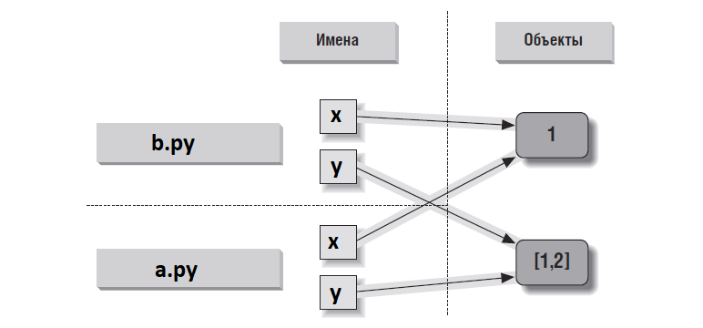

# Работа с модулями

**Имена модулей** - должны соотвествовать тем же правилам, что любые идентификаторы (алфавитные символы, цифры, подчеркивание; не ключевые слова).

То есть пробел в имени файла не допустим, даже если ОС это допускает.

## Использование модулей

Пусть есть файл b.py:
```python
def spam(text):
    print(text, 'spam')
```
Если мы хотим импортировать этот файл и вызвать функцию smap, то можем:

| import | вызов | что значит |
|--|--|----|
| `import b` | b.spam('a') | b - имя переменной, которая ссылается на объект модуля после его загрузки |
| `from b import spam` | spam('a') | импорт модуля + копирование имени spam в пространство имен |
| `from b import *` | spam('a') | импорт модуля + копирование **всех** имен верхнего уровня (вне def или class) |

`from .. *` в Python3 может использоваться только на верхнем уровне.

## as - псевдонимы модулей

Иногда у модуля слишком длинное имя или мы указываем имя модуля с пакетами. Тогда вместе с полным именем можно указать псевдоним, заданный с помощью **as**

```python
import numpy as np
import matplotlib.pyplot as plt
```

### Инструкции import и from - это операции присваивания

import и from - **выполняемые инструкции**, а не "объявления времени компиляции".

* можно вложить в if (импортируем один модуль, иначе импортируем другой)
* можно вложить в def (внутри функции)
* работают только тогда, когда до них дойдет интерпретатор.

Т.е. имена и модули не доступны, пока не были выполнены нужные import.

Операция присваивания, те.
* import присваивает объект модуля единственному имени;
* from присваивает одно или более имен объектам с теми же именами в другом модуле. (т.е становятся ссылками на shared объекты)

b.py:
```python
x = 1
y = [1, 2]
```
a.py:
```python
from b import x, y  # скопировать два имени

x = 42              # изменяется только локальная переменная х
y[0] = 42           # изменяется объект по ссылке y

print(x, y)         # 42, [42, 2]
```



Хотим изменить x в модуле b.py.

* Это очень плохо, потому что потом не найдешь кто где менял эту х.
* Мы не контролируем изменения.
* Инкапсулируйте изменения через вызов функции-обертки в модуле b.py

Но очень хочется:
```python
>>> from small import x, y  # Скопировать два имени
>>> x = 42                  # Изменить только локальное имя x
>>> import small            # Получить имя модуля
>>> small.x = 42            # Изменить x в другом модуле
```

### Что лучше - import или from?

_модуль.атрибут_ 
* плюсы:  
  * понятно из какого модуля используем этот атрибут (полезно при рефакторинге);
  * при одинаковых именах функциях в разных модулях мы явно прописываем из какого модуля используем функцию;
  * не может повредить существующее простанство имен (перезаписать существующую переменую х, которая теперь ссылается на атрибут модуля);
* минусы:
  * длинно, особенно если мы весь модуль, например, работаем с графическим модулем tkinter.
  * см. далее проблемы при reload
  
Рецепт (рекомендательный):
* import - предпочтительнее;
* from .. import - явно перечисляем имена;
* from .. import \* - только при одном таком импорте.

## Пространство имен модуля

**Пространство имен** - место, где создаются имена. 

**Атрибуты модуля** - имена, которые находятся в модуле.

Каждое имя, которому присваивается некоторое значение на верхнем уровне
файла модуля (то есть не вложенное в функции или в классы), превращается
в атрибут этого модуля.

Если в файле b.py на верхнем уровне пишем `x = 1`, то имя х - это атрибут модуля b.

x - глобальная переменная для кода внутри b.py

К х извне можно доступиться по имени b.x

* Инструкции модуля выполняются при первом import.
  * создается объект модуля;
  * инструкции в модуле выполняются одна за другой.
* Присваивание на верхнем уровне создают атрибуты модуля (имена сохраняются в пространстве имен модуля):
  * =
  * def
  * class
* доступ к простанству имен модуля можно получить через b.**\_\_dict\_\_** или **dir(b)**:
  * \_\_dict\_\_ - все, что есть в пространстве - для работы
  * dir - вместе с унаследованными, не полное, отсортированное - для просмотра.
* модуль - единая область видимости (глобальная).

Файл module2.py:
```python
Print('starting to load...')
import sys
name = 42
def func(): pass
class klass: pass
print('done loading.')
```
Импортируем его в интерпретаторе:
```python
>>> import module2
starting to load...
done loading.
```  
То есть код файла b.py действительно выполняется.

Область видимости модуля после импортирования превратилась в пространство имен атрибутов объекта модуля и они доступны по _модуль.атрибут_:
```python
>>> module2.sys
<module 'sys' (built-in)>
>>> module2.name
42
>>> module2.func
<function func at 0x026D3BB8>>
>>> module2.klass
<class module2.klass>
```
**Внутри интерпретатора пространство имен хранится в виде обычного словаря.**
Разные пространства имен - разные словари.

```python
>>> list(module2.__dict__.keys())
['name', '__builtins__', '__file__', '__package__', 'sys', 'klass', 'func',
'__name__', '__doc__']
```
* \_\_file\_\_ - имя файла, из которого был загружен модуль;
* \_\_name\_\_ - имя модуля (без диреторий и расширения файла).

## Квалификация имен атрибутов

Это доступ по _объект.атрибут_

* x - **простая переменная** - ищется в текущих областях видимости по правилу LEGB.
* x.y - **квалифицированное имя** - ищем х в текущих областях видимости, далее ищем атрибут y в объекте х (а не областях видимости)
* x.y.z - **квалифицированные пути** - ищем сначала имя y в объекте х, потом имя z в объекте x.y

Квалификация имен применяется ко всем объектам, имеющим атрибуты (модули, классы, расширения на языке С и тд.)

## Импортирование и область видимости

Никогда не можем получить автоматически доступ к переменным в другом файле. Чтобы доступаться к атрибутам, нужно всегда указывать у какого объекта этот атрибут.

Файл b.py:
```python
x = 88          # x глобальна только для этого файла
def f():
    global x    # будем изменять x в этом файле
    x = 99      # имена в других модулях недоступны
```
Файл a.py:
```python
x = 11          # x глобальна только для этого файла
import b        # получаем доступ к именам в модуле b
b.f()           # изменяет переменную b.x, но не х этого файла
print(x, b.x)   # 11 99
```

Запустим a.py, получим 11 99.

Когда вызвали b.f(), ее глобальной областью видимости будет тот файл, где она **написана**, а не там, откуда вызвана.

### Вложенные пространства имен

Операция импорта не дает возможности из модуля b доступиться к переменным модуля а (к внешней области видимости).

Но можно доступиться к вложенным областям видимости.

```python
# c.py:
x = 3
# b.py:
x = 2
import c
print(x, c.x)        # 2 3
# a.py:
x = 1
import b
print(x, b.x, b.c.x) # 1 2 3
```
Запустим файл a.py:
```python
2 3
1 2 3
```

## Повторная загрузка модулей

* модуль ищется, загружается и выполняется только при первом import;
* при следующих import будет использоваться объект уже загруженного модуля;
* функция **imp.reload** принудительно выполняет загрузку уже загруженного модуля и выполняет его код. Инструкции присваивания, которые выполняются при повтороном запуске, изменяют уже **существующий объект** модуля.
Объект модуля **изменяется**, а не удаляется и создается повторно.

Используется, для ускорения разработки. Поменяли модуль - и можем не останавливая всю программу перегрузить его и выполнить заново какие-то функции.

**Обновление сервисов, которые нельзя останавливать.**

reload повторно загружает только модули на языке Python. На языке С, например, могут загружаться динамически, но не могут перегужаться через reload.

Отличия reload от import:
* Функция, а не инструкция.
* ей передается объект модуля, а не имя.
* не забудьте `import imp`

```python
import module               # Первоначальное импортирование
что-то делаем, используя этот модуль
from imp import reload      # Импортировать функцию reload (в 3.0)
reload(module)              # Загрузить обновленный модуль
делаем что-то дальше, используя обновленные атрибуты модуля
```

* **Функция reload запускает новый программный код в файле модуля в теку-
щем пространстве имен модуля**. При повторном выполнении программный
код перезаписывает существующее пространство имен вместо того, чтобы
удалять его и создавать вновь.
* **Инструкции присваивания на верхнем уровне файла замещают имена но-
выми значениями**. Например, повторный запуск инструкции def приводит
к замещению предыдущей версии функции в пространстве имен модуля,
выполняя повторную операцию присваивания имени функции.
* **Повторная загрузка оказывает воздействие на всех клиентов, использо-
вавших инструкцию import для получения доступа к модулю.** Клиенты,
использовавшие инструкцию import, получают доступ к атрибутам модуля,
указывая полные их имена, поэтому после повторной загрузки они будут
получать новые значения атрибутов.
* **Повторная загрузка будет воздействовать лишь на тех клиентов, которые
еще только будут использовать инструкцию from в будущем.** Клиенты, ко-
торые использовали инструкцию from для получения доступа к атрибутам
в прошлом, не заметят изменений, произошедших в результате повторной
загрузки, – они по-прежнему будут ссылаться на старые объекты, получен-
ные до выполнения перезагрузки.

